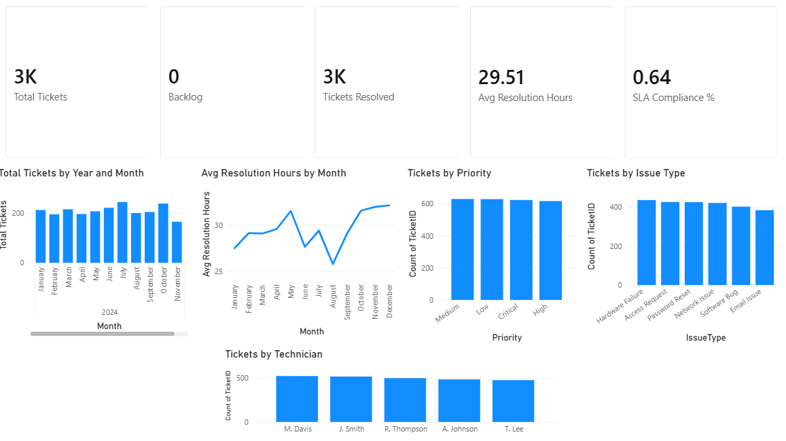

	IT Service Desk Ticket Analysis Dashboard
End-to-end analytics project using Excel, Power Query, SQL, and Power BI

I processed and analyzed ticket data across its full lifecycle using:

Excel (initial cleanup, validation)

Power Query (automated transformations)

SQL (exploratory analysis + KPI validation)

Power BI (data modeling, DAX, and dashboarding)

The result is a clean, professional IT Service Desk Performance Dashboard that highlights workload, SLA compliance, resolution time, and technician performance.

 Project Workflow Overview
 	Excel (Initial Cleanup)

Removed blank rows & duplicates

Fixed inconsistent date formats

Checked for anomalies before importing

Calculated helper fields like ResolutionHours and ResolutionDays

	Power Query in Excel (Automated Cleaning & Transformation)

I imported the dataset into Power Query to automate the cleaning process.

Transformations performed:

Converted columns to proper types (DateTime, Text, Whole Number)

Trimmed and cleaned text fields

Created custom columns:

ResolutionHours = Duration.TotalHours(ClosedDate – CreatedDate)

ResolutionDays

SLAMetNumeric (1 = Met SLA, 0 = Missed SLA)

Removed errors

Replaced inconsistent values

Applied standardized naming conventions

Ensured dataset was ready for SQL + Power BI modeling

This created a repeatable cleaning pipeline—a key real-world analyst skill.

	SQL (Exploratory Analysis & KPI Validation)

I wrote SQL queries to validate key metrics before finishing DAX modeling.

Example queries include:

-- Total Tickets
SELECT COUNT(*) FROM Tickets;

-- Tickets Resolved
SELECT COUNT(*) FROM Tickets WHERE ClosedDate IS NOT NULL;

-- Average Resolution Hours
SELECT AVG(ResolutionHours) FROM Tickets;

-- Tickets by Priority
SELECT Priority, COUNT(*) FROM Tickets GROUP BY Priority;

-- Tickets by Issue Type
SELECT IssueType, COUNT(*) FROM Tickets GROUP BY IssueType;

The full SQL file is included here:
 sql/TicketAnalysis.sql

	Power BI (Data Modeling, DAX, Dashboard)

Power BI was used to model the cleaned dataset and calculate key performance indicators.

Key DAX Measures
Tickets Resolved =
CALCULATE(
    COUNTROWS('Tickets'),
    NOT ISBLANK('Tickets'[ClosedDate])
)

Backlog =
[Total Tickets] - [Tickets Resolved]

Avg Resolution Hours =
AVERAGE('Tickets'[ResolutionHours])

SLA Compliance % =
DIVIDE(
    SUM('Tickets'[SLAMetNumeric]),
    COUNTROWS('Tickets')
)

	Final Dashboard (Power BI)

The dashboard includes a top-level executive summary and detailed breakdowns.

	Top KPIs

Total Tickets – 3,000

Backlog – 0

Tickets Resolved – 3,000

Average Resolution Hours – ~30 hrs

SLA Compliance – 64%

	Visuals

Tickets by Month (Trend)

Resolution Hours by Month (Performance trend)

Tickets by Priority

Tickets by Issue Type

Tickets by Technician

Clean KPI row at the top

	

	Insights & Takeaways
 Ticket Volume

Ticket creation stays consistent throughout the year, with moderate fluctuations.

 Resolution Performance

Resolution hours trend downward mid-year, showing operational improvement.

 SLA Compliance

SLA met ~64% of the time → opportunity for faster responses.

 Top Issue Drivers

Most common issues:

Password resets

Access issues

Hardware problems

Network/VPN issues

 Technician Workload

Tickets are evenly distributed among technicians, suggesting balanced assignments.

	 Technologies & Skills Demonstrated
Skill	Description
Excel	Initial cleanup, validation, helper columns
Power Query	Automated data transformations, data typing, custom columns
SQL	Exploratory queries, KPI validation
Power BI	Dashboard design, data modeling
DAX	KPI calculation and modeling
Data Visualization	Trend charts, categorical breakdowns, KPI cards
Data Cleaning	Standardizing formats, removing errors
	Repository Structure
/data
    └── Tickets.xlsx         # Cleaned dataset (Power Query applied)

/sql
    └── tickets_analysis.sql  # All SQL queries in one script

/powerbi
    └── itTickets.pbix  # Final dashboard file

README.md

	Why This Project Matters

This project demonstrates end-to-end analytics ability:

Cleaning and transforming raw data

Automating prep with Power Query

Writing SQL queries

Building DAX measures

Designing a clean BI dashboard

Explaining insights clearly

